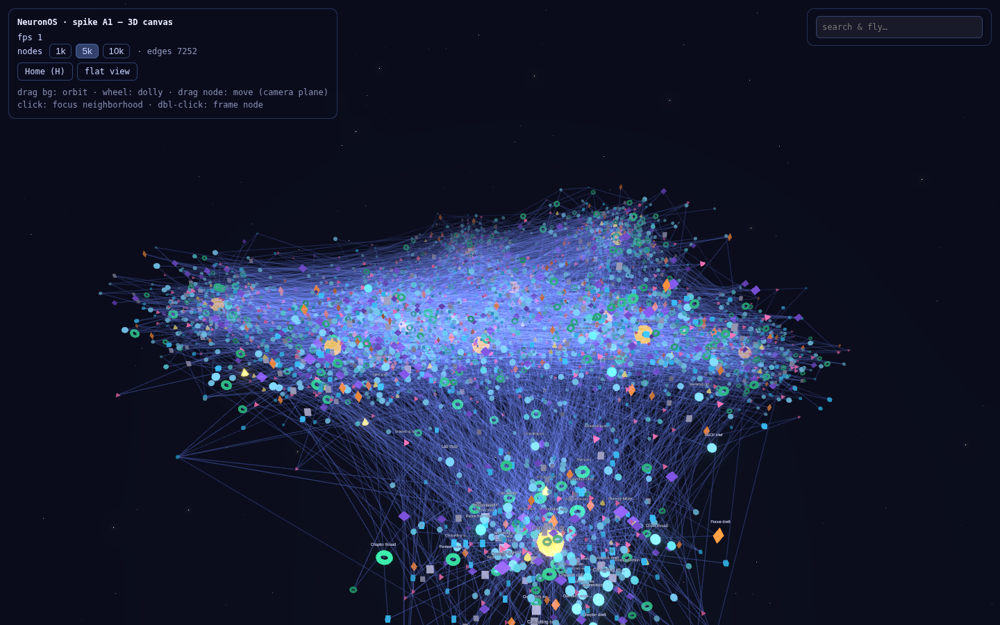
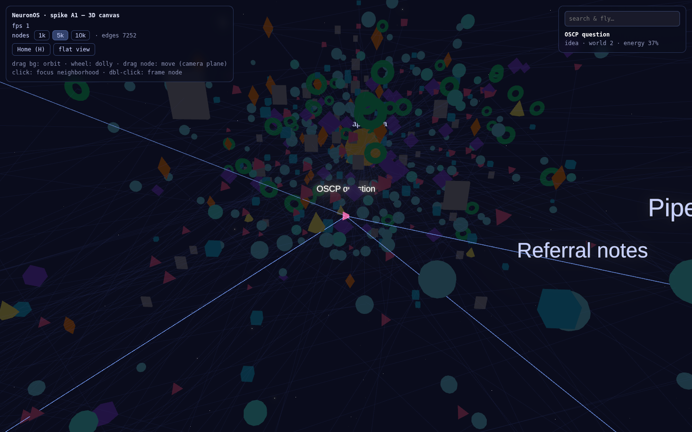
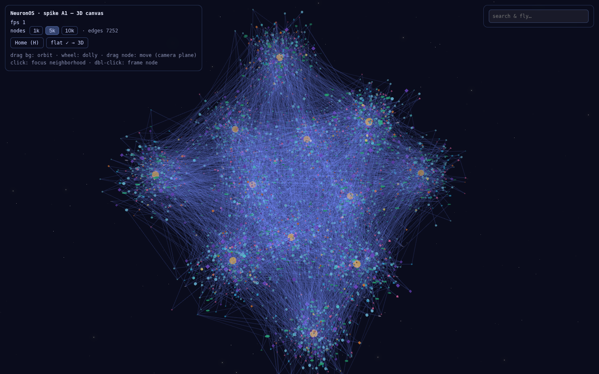

# Spike A1 — 3D Canvas De-Risk

**Status: complete (first pass).** Phase A of the [Development Roadmap](../../docs/planning/13-development-roadmap.md); tests the doc-06 3D mitigation table at toy scale. Spike code is disposable evidence, not product code — the production canvas (Phase B3) is informed by, not copied from, this.

## Run

```bash
cd spikes/a1-canvas
npm install
npm run dev        # http://localhost:3000
```

Controls: drag = orbit (pitch clamped, roll locked) · wheel = dolly · click node = focus neighborhood · double-click = frame · drag node = move on camera-parallel plane · `H` = home · `Esc` = deselect · HUD: node count 1k/5k/10k, search-and-fly, flat view.

## What it exercises (→ doc 06 mitigation table)

| Concern | Implementation here |
|---|---|
| Rendering scale | One `InstancedMesh` per node type (10 draw calls for 10k nodes); all edges in one `LineSegments`; bloom post; fog; ~5k nodes + ~7k edges by default |
| Occlusion | World depth-bands + squashed "galaxy" layout; selection focus-dimming (non-neighborhood → ghosts) |
| Label legibility | Billboarded SDF text (troika via drei), top-56 by vitality/distance re-ranked 4×/s, distance tiers full → truncated → none |
| Disorientation | Damped orbit, clamped pitch, locked roll; choreographed fly-to (ease-out, never teleports); `H` home reset |
| Imprecise manipulation | Raycast picking on instances; node drag constrained to the camera-parallel plane |
| Fallback | Flat view: animated transition to constrained top-down, rotation disabled, screen-space pan |

## Screenshots (headless Chromium, SwiftShader)

| Galaxy (5k nodes) | Fly-to + focus dim | Flat view |
|---|---|---|
|  |  |  |

## Findings so far

1. **Feasibility: yes.** Full stack (Next 15 + React 19 + r3f 9 + drei 10 + postprocessing) composes cleanly; instancing keeps draw calls flat; the whole interaction set works, verified headless (scripted search-fly-select-flat pass).
2. **⚠ FPS numbers from this container are meaningless** (software rendering: 1–2fps). The NFR-1 bar (60fps @ 1k visible on a 2022 MacBook Air) **must be measured on real hardware** — that measurement is the remaining Phase-A exit criterion. Run `npm run dev`, use the HUD fps meter at 1k/5k/10k.
3. **Offline/CSP trap found (real product lesson):** drei's `Text` fetches its default font *and* unicode-resolver data from CDNs at runtime; behind a proxy this suspended React and blanked the entire app. Fixes applied: bundle the label font locally (`public/fonts/label.ttf` — Liberation Sans, SIL OFL) and isolate labels in their own `<Suspense>` so font failure degrades to "no labels," never a blank canvas. **Carry both rules into the product build (B3).**
4. **Label declutter needs real work.** Distance tiers + top-K help, but labels still collide near cluster cores; fly-to framing needed tuning (stop distance 72, smaller near-tier type). Production needs screen-space overlap resolution (grid-bucket rejection) — noted for B3, not spike-blocking.
5. **Edge haze:** 7k additive edges read as fog from the galaxy view. Cluster-proxy LOD (fade individual edges past a distance, draw cluster-to-cluster aggregate lines) is the right fix; **not yet implemented** — the one doc-06 mitigation this spike hasn't proven.
6. **React strict-mode is off** in the spike; production must re-enable it with proper three.js resource disposal (a known r3f discipline, deferred here deliberately).

## Remaining Phase-A work

- [ ] Hardware fps measurement (founder's machine + one low-end reference) at 1k/5k/10k — the actual exit gate
- [ ] Cluster-proxy LOD prototype (finding 5)
- [ ] 3 non-founder navigation tests (doc 13 Phase A: watch them find a node, return home, and describe where things are)
- [ ] Decide r3f vs. raw three for production (current evidence: r3f ergonomics won and nothing forced ejecting)
- [ ] Spike A2 (AI pipeline) — **blocked on model API keys**, not runnable in this environment
